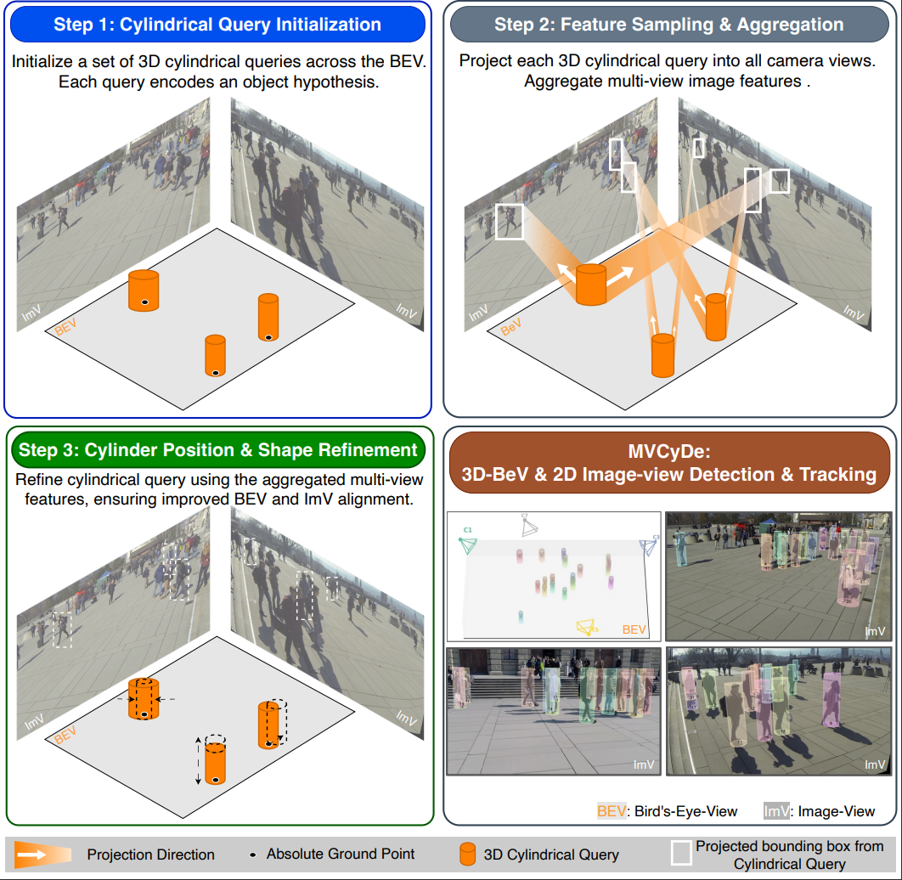

# MVDGC: Joint 3D and 2D Multi-view Pedestrian Detection via Dual Geometric Constraints

<p align="center">
  
</p>

> **MVDGC** detects people jointly in bird's-eye-view (BEV) ground space and per-camera image space using a set of learnable 3D cylindrical queries. Each query is initialized across the BEV plane, projected into every camera view to sample multi-view features via sparse deformable attention, and iteratively refined to produce accurate ground-plane positions and per-view bounding boxes — all in a single forward pass, with no depth estimation or explicit 3D reconstruction.

---

## How It Works

| Step | Description |
|------|-------------|
| **1 — Cylindrical Query Initialization** | A grid of 3D cylindrical queries is placed across the BEV. Each cylinder encodes a person hypothesis with a ground location (x, y), radius, and height. |
| **2 — Feature Sampling & Aggregation** | Each query is projected into all camera views. Multi-view image features are sampled at the projected locations via multi-scale deformable attention and fused across views. |
| **3 — Cylinder Position & Shape Refinement** | Fused features refine each cylinder's ground position and shape through multiple decoder layers, producing aligned BEV detections and 2D image-view bounding boxes simultaneously. |

---

## Supported Datasets

| Dataset | Cameras | Frames | Scene | Config |
|---------|---------|--------|-------|--------|
| [Wildtrack](https://www.epfl.ch/labs/cvlab/data/data-wildtrack/) | 7 | 400 | Outdoor plaza | `configs/wildtrack.yaml` |
| [MultiviewX](https://github.com/hou-yz/MultiviewX) | 6 | 400 | Synthetic | `configs/multiviewx.yaml` |
| [GMVD](https://github.com/kev-in-ta/GMVD) | 8 | 2000 | Outdoor campus | `configs/gmvd.yaml` |

---

## Installation

### 1. Clone the repository

```bash
git clone <repo-url>
cd MVDGC
```

### 2. Create a Python 3.8 environment

```bash
conda create -n mvcyde python=3.8 -y
conda activate mvcyde
```

### 3. Install PyTorch 2.1 with CUDA 12.1

```bash
pip install torch==2.1.0 torchvision==0.16.0 \
    --index-url https://download.pytorch.org/whl/cu121
```

### 4. Install mmcv-full (required for the ViT backbone)

```bash
pip install mmcv-full==1.7.2 -f \
    https://download.openmmlab.com/mmcv/dist/cu121/torch2.1/index.html
pip install mmengine==0.10.7
```

> **Note:** `mmcv-full` must match your CUDA and PyTorch versions exactly. If the prebuilt wheel is not available, build from source: `MMCV_WITH_OPS=1 pip install mmcv-full==1.7.2`

### 5. Install remaining dependencies

```bash
pip install -r requirements.txt
```

### 6. Build the custom CUDA operator

The multi-scale deformable attention CUDA kernel must be compiled before training.

```bash
cd models/ops
bash make.sh
cd ../..
```

Verify the build succeeded:

```bash
python models/ops/test.py
```

### 7. Prepare datasets

Set the `ROOT` path in the config file for your chosen dataset:

```yaml
# configs/wildtrack.yaml
DATASET:
  ROOT: '/path/to/Wildtrack_dataset'

# configs/multiviewx.yaml
DATASET:
  ROOT: '/path/to/MultiviewX'

# configs/gmvd.yaml
DATASET:
  ROOT: '/path/to/GMVD'
```

---

## Training

```bash
# Wildtrack
python main_sparse_deform_batch.py \
    --cfg ./configs/wildtrack.yaml \
    --exp_name wildtrack_run1

# MultiviewX
python main_sparse_deform_batch.py \
    --cfg ./configs/multiviewx.yaml \
    --exp_name multiviewx_run1

# GMVD
python main_sparse_deform_batch.py \
    --cfg ./configs/gmvd.yaml \
    --exp_name gmvd_run1
```

---

## Evaluation

Set the checkpoint name inside `test_sparse_deform.py`:

```python
# test_sparse_deform.py  (line ~80)
weight_name = "wildtrack_epoch_28.pth"   # file must be inside output/
```

Then run:

```bash
python test_sparse_deform.py --cfg ./configs/wildtrack.yaml
```

## Citation

If you use this work in your research, please cite:

```bibtex
@article{mvdgc2026,
  title   = {MVDGC: Joint 3D and 2D Multi-view Pedestrian Detection via Dual Geometric Constraints},
  author  = {},
  year    = {2024}
}
```

---

## Acknowledgements

This project builds upon:
- [Deformable DETR](https://github.com/fundamentalvision/Deformable-DETR) — sparse deformable attention
- [mmdetection](https://github.com/open-mmlab/mmdetection) — ViT backbone and SFP neck
- [MVDeTr](https://github.com/hou-yz/MVDeTr) — multi-view detection framework

Please refer to their respective licenses when using this code.
